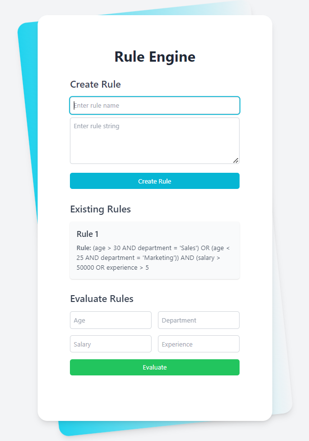

# Rule Engine

## Key Features

- **Advanced 3-Tier Rule Engine:** Dynamically evaluates user eligibility based on multiple attributes.
- **AST-Based Rule Representation:** Uses abstract syntax trees for flexible rule creation and management.
- **Dynamic Rule Versioning:** Supports rule updates with history tracking and rollback.
- **Performance-Optimized Evaluation:** Efficient processing of complex rules across large datasets.

## Demo

## Table of Contents

1. [Features](#features)
2. [Technologies Used](#technologies-used)
3. [Prerequisites](#prerequisites)
4. [Setup and Installation](#setup-and-installation)
5. [Running the Application](#running-the-application)
6. [API Endpoints](#api-endpoints)
7. [Usage Guide](#usage-guide)
8. [Design Choices](#design-choices)
9. [Future Enhancements](#future-enhancements)

## Features

- Create and store complex eligibility rules using a string-based syntax
- Combine multiple rules into a single, unified rule set
- Evaluate user data against the combined rule set
- Intuitive user interface for rule creation, management, and evaluation
- RESTful API for rule management and evaluation

## Technologies Used

- Backend:
  - Node.js (v14+)
  - Express.js (v4.17+)
  - MongoDB (v4.4+)
  - Mongoose (v5.12+)
- Frontend:
  - React (v17+)
  - Axios (v0.21+)
  - Tailwind CSS (v2.2+)

## Prerequisites

- Node.js (v14 or later)
- npm (v6 or later)
- MongoDB (v4.4 or later)

## Setup and Installation

1. Clone the repository:
2. Install backend dependencies:
3. Install frontend dependencies:
4. Set up MongoDB:
- Ensure MongoDB is installed and running on your system
- Create a new database named `rule_engine`

5. Create a `.env` file in the `backend` directory with the following content:
## Running the Application

1. Start the backend server:The server will start on `http://localhost:5000`

2. In a new terminal, start the frontend development server:The React app will start on `http://localhost:3000`

3. Open your browser and navigate to `http://localhost:3000` to use the application.

## API Endpoints

- `POST /api/rules`: Create a new rule
- Body: `{ "name": "Rule Name", "ast": "Rule string" }`
- `GET /api/rules`: Retrieve all rules
- `GET /api/rules/:id`: Retrieve a specific rule
- `PUT /api/rules/:id`: Update a specific rule
- Body: `{ "name": "Updated Rule Name", "ast": "Updated rule string" }`
- `DELETE /api/rules/:id`: Delete a specific rule
- `POST /api/evaluate`: Evaluate user data against the combined rules
- Body: `{ "age": 30, "department": "Sales", "salary": 50000, "experience": 5 }`

## Usage Guide

1. Creating a Rule:
- Enter a rule name and the rule string in the "Create Rule" section
- Rule string format: `((age > 30 AND department = 'Sales') OR (age < 25 AND department = 'Marketing')) AND (salary > 50000 OR experience > 5)`
- Click "Create Rule" to save the rule

2. Viewing Existing Rules:
- All created rules are displayed in the "Existing Rules" section

3. Evaluating Rules:
- Enter user data in the "Evaluate Rules" section
- Click "Evaluate" to check if the user is eligible based on all existing rules

## Design Choices

1. **Abstract Syntax Tree (AST)**: Chosen for representing rules due to its ability to handle complex, nested logical expressions and ease of evaluation.

2. **MongoDB**: Selected for its flexibility in storing complex data structures like our AST representation of rules.

3. **Express.js**: Utilized for its simplicity and wide adoption in the Node.js ecosystem, providing a robust foundation for our RESTful API.

4. **React**: Employed for its component-based architecture, allowing for the creation of reusable UI elements and efficient DOM updates.

5. **Tailwind CSS**: Adopted for its utility-first approach, enabling rapid UI development with consistent styling.

6. **Rule Combination**: Implemented using a simple AND combination, which can be extended for more complex logic in future iterations.

7. **Error Handling**: Incorporated throughout the application to provide meaningful feedback to users and developers.

8. **Modular Structure**: Code organized into separate modules (routes, models, utils) to enhance maintainability and scalability.

9. **RESTful API**: Designed following RESTful principles for consistency and ease of use.

10. **Frontend State Management**: Utilized React's built-in useState and useEffect hooks, suitable for the current application complexity.

11. **Responsive Design**: Implemented to ensure a seamless experience across various devices and screen sizes.

## Future Enhancements

1. Implement user authentication and authorization
2. Add support for more complex rule combinations (e.g., nested AND/OR operations)
3. Create a visual rule builder interface
4. Implement rule versioning and history tracking
5. Add unit and integration tests for both frontend and backend
6. Optimize rule evaluation for large datasets
7. Implement real-time rule updates using WebSockets
8. Add support for custom functions in rule definitions
9. Create a dashboard for rule performance and usage analytics

This Rule Engine project provides a solid foundation for managing and evaluating complex eligibility rules. Its modular design and use of modern technologies allow for easy extension and modification to meet evolving business needs.
